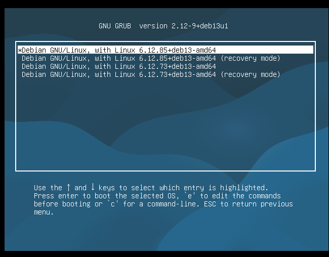
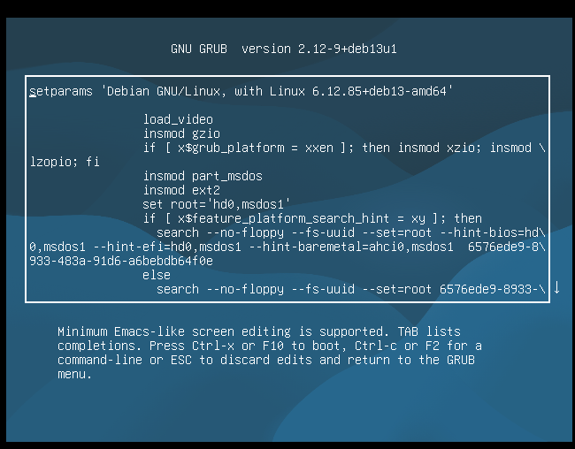
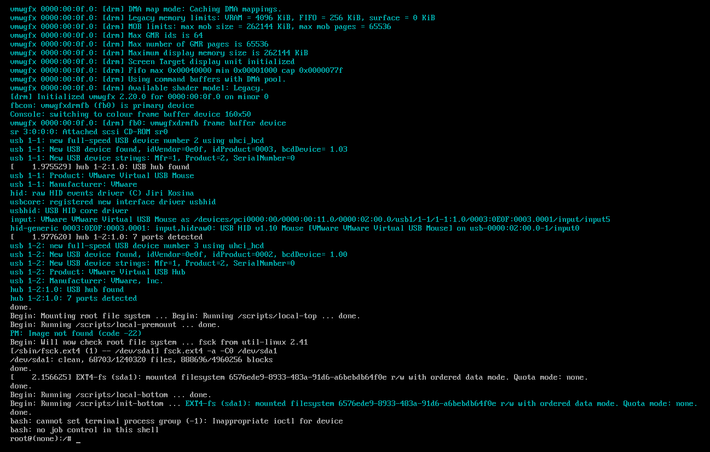
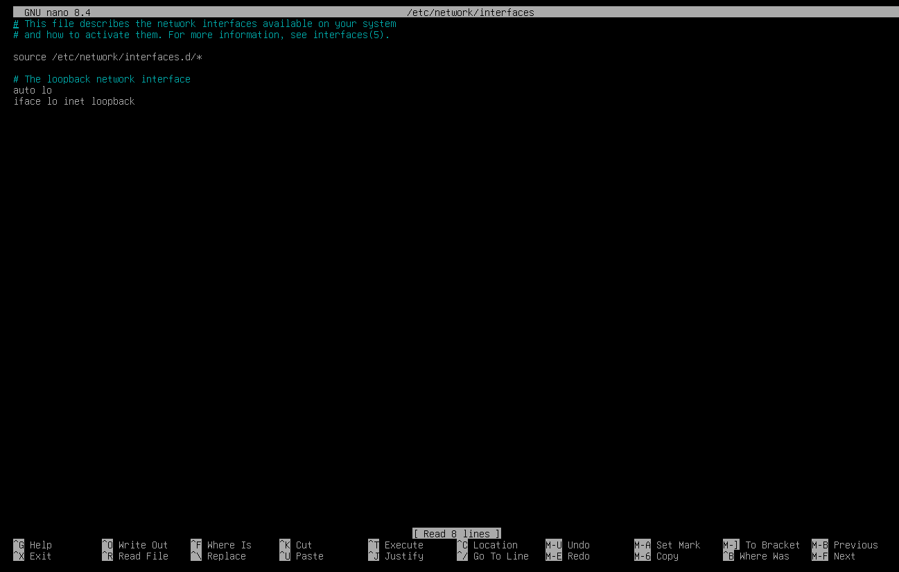
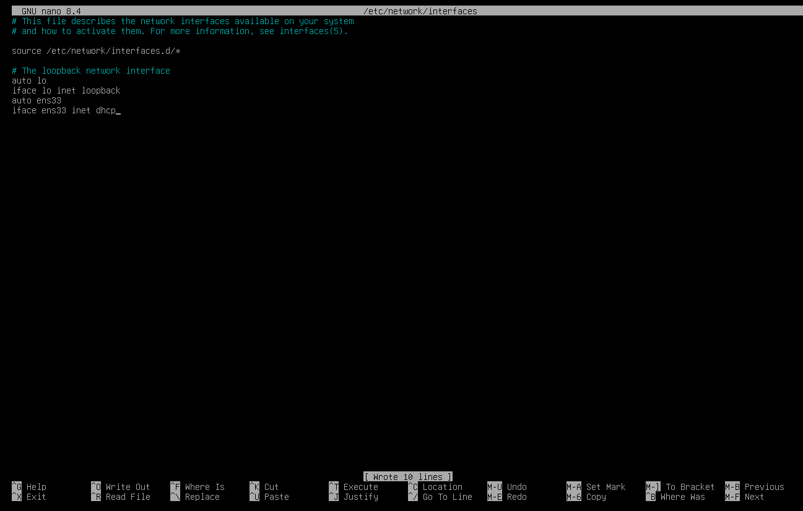

# Incidents & Problèmes rencontrés

## 001 — Mot de passe oublié sur srv-debian01

**Date :** 14 Mai 2026
**Contexte :** Mot de passe utilisateur kenny et root oubliés

### Symptôme
Impossible de se connecter à la VM — mot de passe incorrect.

### Résolution
Réinitialisation via modification des paramètres GRUB au démarrage :

1. Au menu GRUB appuyer sur "e" pour éditer
2. Sur la ligne commençant par "linux", remplacer "ro quiet" par :
   rw init=/bin/bash
3. Ctrl+X pour démarrer
4. Réinitialiser les mots de passe :

sudo passwd kenny
sudo passwd root

5. Redémarrer :
exec /sbin/init

### Leçon retenue
En mode recovery le clavier est en QWERTY par défaut.
Mettre les mots de passe dans un gestionnaire de mots
de passe pour ne pas avoir à tous les retenir (et les
oublier).

---

## 002 — Interface réseau ens33 DOWN après recovery

**Date :** 14 Mai 2026
**Contexte :** Après la manipulation recovery, l'interface
réseau ne montait plus au démarrage.

### Symptôme
ip a ne retournait aucune adresse IP sur ens33 — 
interface en état DOWN.

### Diagnostic
cat /etc/network/interfaces

Le fichier ne contenait que la configuration loopback (lo) — 
ens33 n'était pas configurée. La manipulation recovery avait 
effacé la configuration automatique créée lors de l'installation.

### Résolution
Ajout manuel de la configuration dans /etc/network/interfaces :

```bash
auto ens33
iface ens33 inet dhcp
```

Puis redémarrage du service réseau :
sudo systemctl restart networking

### Leçon retenue
Toujours vérifier /etc/network/interfaces si une interface 
réseau ne monte pas au démarrage. En production on 
configurerait une IP statique pour éviter ce type de problème.

## Screenshots






