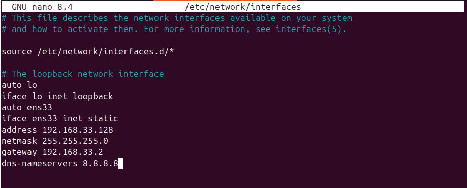
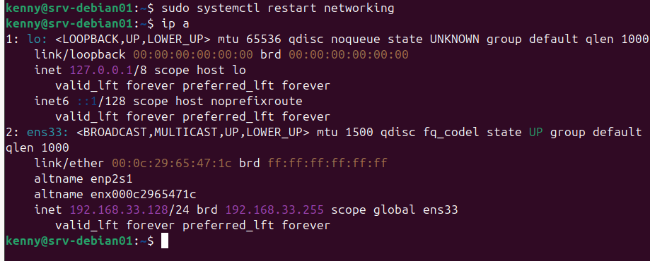
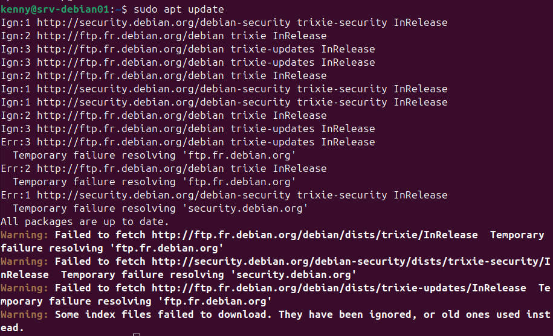
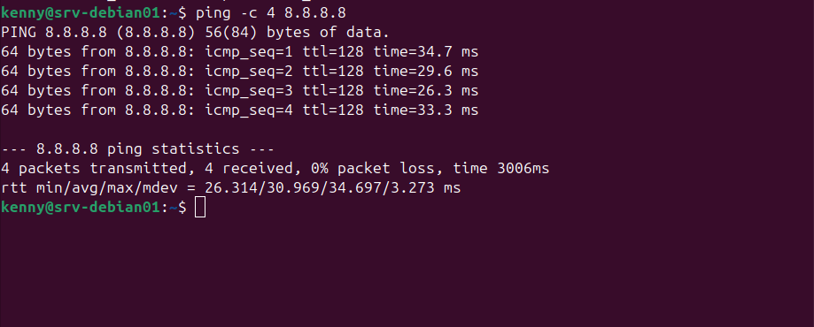

# Configuration réseau — srv-debian01

## Contexte
Configuration d'une adresse IP statique sur srv-debian01.
En entreprise les serveurs ont toujours une IP fixe pour garantir
la stabilité des connexions SSH et des services réseau.

## Interface réseau

| Paramètre | Valeur |
|-----------|--------|
| Interface | ens33 |
| IP | 192.168.33.128 |
| Masque | 255.255.255.0 (/24) |
| Gateway | 192.168.33.2 (routeur NAT VMware) |
| DNS primaire | 8.8.8.8 (Google) |
| DNS secondaire | 1.1.1.1 (Cloudflare) |

## 1. Configuration IP statique

Fichier à modifier : `/etc/network/interfaces`

```bash
sudo nano /etc/network/interfaces
```

Contenu du fichier :

```
auto lo
iface lo inet loopback

auto ens33
iface ens33 inet static
    address 192.168.33.128
    netmask 255.255.255.0
    gateway 192.168.33.2
    dns-nameservers 8.8.8.8
```

Application des changements :

```bash
sudo systemctl restart networking
```

Vérification :

```bash
ip a
```

Résultat attendu sur ens33 :
- `state UP` ✅
- `inet 192.168.33.128/24` ✅
- `valid_lft forever` → confirme que c'est une IP statique ✅

## 2. Configuration DNS

Lors du passage en IP statique, `/etc/resolv.conf` n'est plus
alimenté automatiquement par le client DHCP — personne ne le
remplit donc la résolution DNS ne fonctionne plus.

Symptôme observé lors d'un `apt update` :

Temporary failure resolving 'ftp.fr.debian.org'

Correction — éditer manuellement `/etc/resolv.conf` :

```bash
sudo nano /etc/resolv.conf
```

Contenu :

nameserver 8.8.8.8
nameserver 1.1.1.1

Pourquoi deux serveurs DNS :
- `8.8.8.8` → DNS primaire Google
- `1.1.1.1` → DNS secondaire Cloudflare — utilisé automatiquement
si le primaire ne répond pas

## 3. Vérifications

```bash
# Vérifier la connectivité réseau
ping -c 4 8.8.8.8

# Vérifier la résolution DNS
ping -c 4 google.com
```

## Points de vigilance

- Toujours configurer `/etc/resolv.conf` manuellement après
passage en IP statique
- En entreprise utiliser le DNS interne plutôt que `8.8.8.8`
pour éviter que les requêtes DNS sortent du réseau
- `valid_lft forever` dans `ip a` confirme que l'IP est statique

## Screenshots







## Réflexions et apprentissages

- Je me suis demandé pourquoi le fichier resolv.conf se trouve dans /etc et non pas
  /var étant donné que c'est un fichier très souvent variable (alimenté par le dhcp)
  L'explication : - c'est un fichier de configuration qui doit, de ce fait, se trouvé
  dans /etc d'après le FHS qui est un standard de hierarchie des fichiers sur Linux.
  De plus /var contient les données générées automatiquement par le système alors que
  /etc contient la configuration décidée par l'admin.
 
