# Gestion des disques — srv-debian01

## Contexte
Ajout d'un disque de stockage dédié aux données de la Société DeltaWay.
Les dossiers /srv/deltaway commencent à grossir — on sépare les données
du système sur un disque dédié, bonne pratique en entreprise.

## Infrastructure disques

| Disque | Taille | Rôle |
|--------|--------|------|
| sda (après reboot) | 20 GB | Disque système — partition / |
| sdb (après reboot) | 10 GB | Disque données — /srv/deltaway/stockage |

## Commandes essentielles

### Lister les disques et partitions
```bash
lsblk
```

### Voir l'espace disque disponible
```bash
df -h
df -h | grep nom-partition
```

### Voir l'espace utilisé par les dossiers
```bash
du -sh /chemin/dossier/*
sudo du -sh /chemin/dossier/*  # avec sudo pour les dossiers restreints
```

### Partitionner un disque
```bash
sudo fdisk /dev/sdX
```
Commandes fdisk :
- `m` → aide
- `n` → nouvelle partition
- `p` → partition primaire
- `w` → écrire et quitter

### Formater une partition
```bash
sudo mkfs.ext4 /dev/sdX1
```

### Monter/Démonter un disque temporairement
```bash
sudo mount /dev/sdX1 /chemin/point-de-montage
sudo umount /chemin/point-de-montage
```

### Monter automatiquement au démarrage
Éditer `/etc/fstab` :
```bash
sudo nano /etc/fstab
```
Après modification recharger systemd :
```bash
sudo systemctl daemon-reload
sudo mount -a  # teste le montage sans redémarrer
```

## Procédure complète — Ajout disque de données DeltaWay

### 1. Détection du nouveau disque
```bash
lsblk
```
Vérifier la taille pour identifier le bon disque avant toute manipulation.
Ne jamais travailler sur un disque sans avoir vérifié sa taille ! ⚠️

### 2. Partitionnement
```bash
sudo fdisk /dev/sda
# n → nouvelle partition
# p → primaire
# Entrée × 3 → valeurs par défaut (partition unique sur tout l'espace)
# w → écrire
```

### 3. Formatage en ext4
```bash
sudo mkfs.ext4 /dev/sda1
```
ext4 est le système de fichiers standard Linux — stable, performant,
avec journalisation pour la récupération en cas de crash.

### 4. Création du point de montage
```bash
sudo mkdir /srv/deltaway/stockage
```

### 5. Montage temporaire (test)
```bash
sudo mount /dev/sda1 /srv/deltaway/stockage
df -h | grep sda1
```
On teste d'abord avec un montage temporaire — une erreur dans fstab
peut empêcher le serveur de démarrer. Tester avant d'écrire dans
fstab est très important en administration système.

### 6. Récupération de l'UUID
```bash
sudo blkid /dev/sda1
```
On utilise l'UUID plutôt que /dev/sda1 car le nom du disque peut
changer au redémarrage — l'UUID lui est permanent.

### 7. Montage permanent dans fstab
```bash
sudo nano /etc/fstab
```
Ligne ajoutée :

UUID=37e01535-ccb5-4280-97cf-2bd212207108 /srv/deltaway/stockage ext4 defaults 0 2

Colonnes de fstab :
- **UUID** → identifiant unique du disque
- **/srv/deltaway/stockage** → point de montage
- **ext4** → système de fichiers
- **defaults** → options standard
- **0** → pas de sauvegarde avec dump
- **2** → vérification disque au boot après le disque système (1)

### 8. Application et test
```bash
sudo umount /srv/deltaway/stockage
sudo systemctl daemon-reload
sudo mount -a
df -h | grep sda1
```

## Incident — Noms de disques qui s'échangent au redémarrage

Après le reboot le disque de données qui s'appelait `sda` est
devenu `sdb` et vice versa. Lorsque j'ai fait un df -h je me
suis rendu compte que sda1 n'était pas monté sur le point de 
montage que j'avais décidé, j'ai donc lancé un blkid et me suis
rendu compte que l'uuid de sda1 n'était pas celui que j'avais 
rentré dans le fichier fstab contrairement à sdb1 qui possédait
cet uuid — preuve concrète que les noms des disques se sont 
échangés au démarrage et qu'il faut toujours utiliser les UUID 
dans fstab pour éviter que cet échange nous cause des problèmes 
par la suite. Avec l'uuid le bon disque se montera toujours sur 
le bon point de montage.

## Réflexions et apprentissages

- J'ai compris concrètement et par l'expérience pourquoi on utilise
  les UUID dans fstab — les noms de disques (sda, sdb) peuvent
  s'échanger au redémarrage selon l'ordre de détection. L'UUID
  lui est permanent et unique. Sans cette mésaventure j'aurais
  juste retenu la théorie.

- J'ai compris la différence entre montage temporaire (mount) et
  montage permanent (fstab) — on teste toujours avec mount avant
  d'écrire dans fstab car une erreur dans fstab peut empêcher le
  serveur de démarrer complètement.

- J'ai remarqué que le système utilisait déjà des UUID pour les
  autres partitions dans fstab — ce qui m'a alerté que notre
  première entrée avec /dev/sda1 n'était pas cohérente avec
  le reste du fichier.

- lost+found : dossier créé automatiquement par ext4 sur chaque
  partition formatée — sert à récupérer des fichiers corrompus
  en cas de crash disque.

## Screenshots

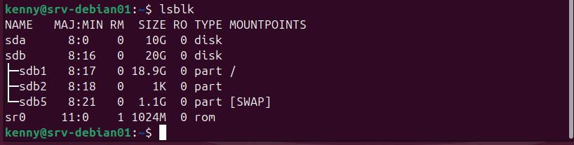
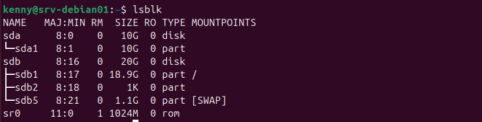
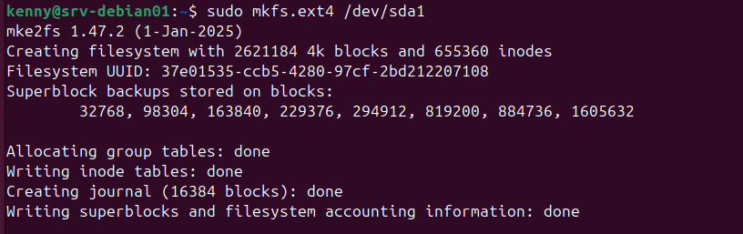
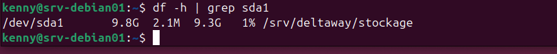
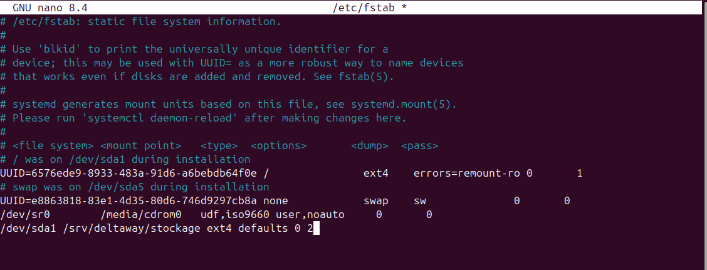
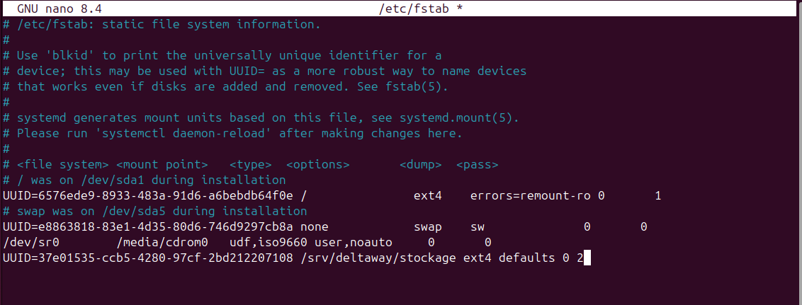
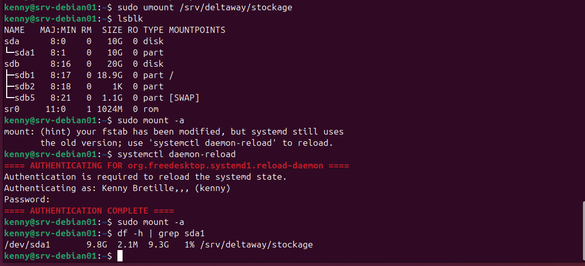
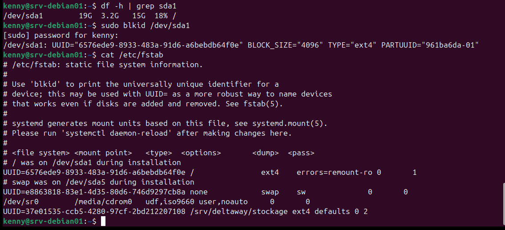
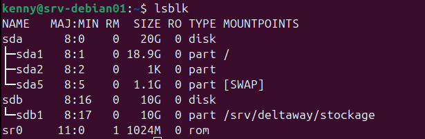
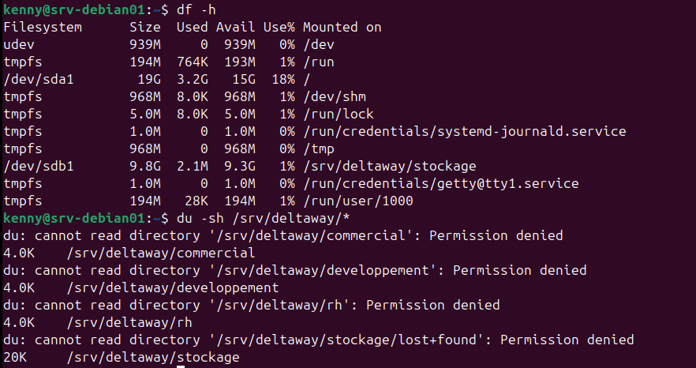
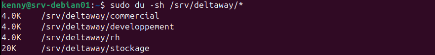
