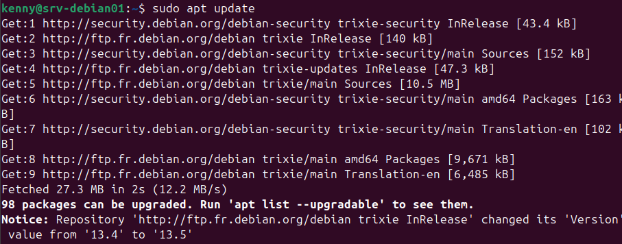
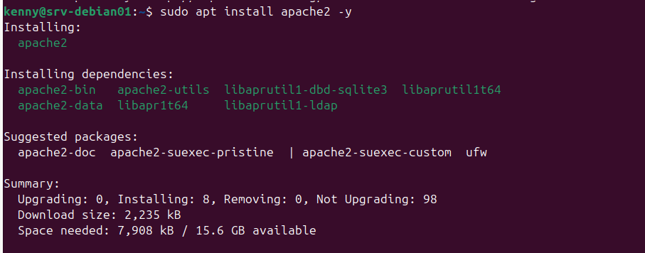
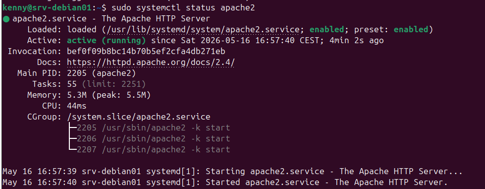
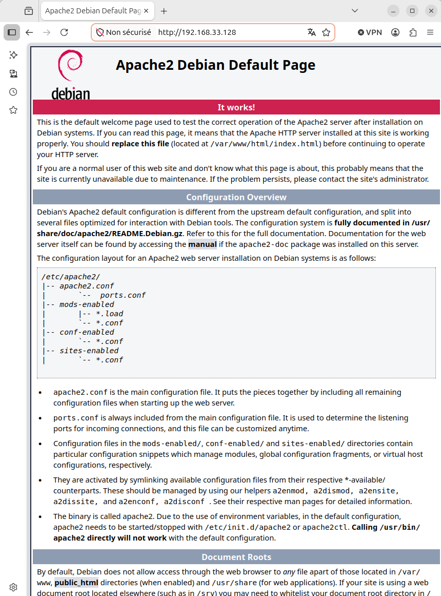
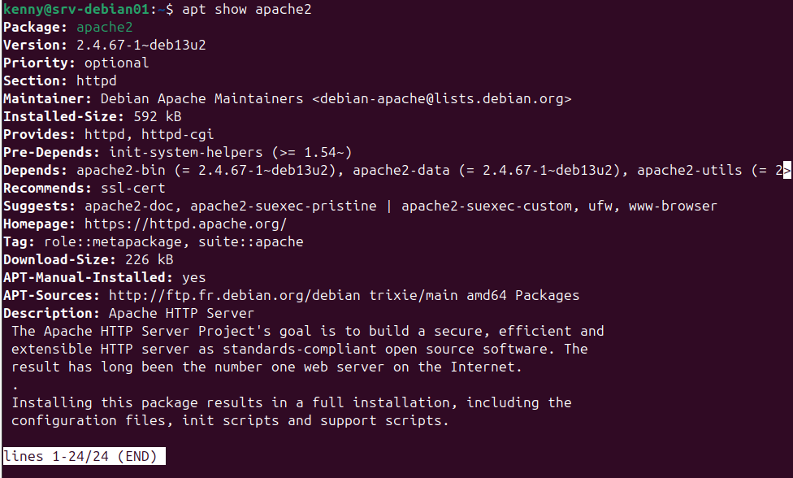
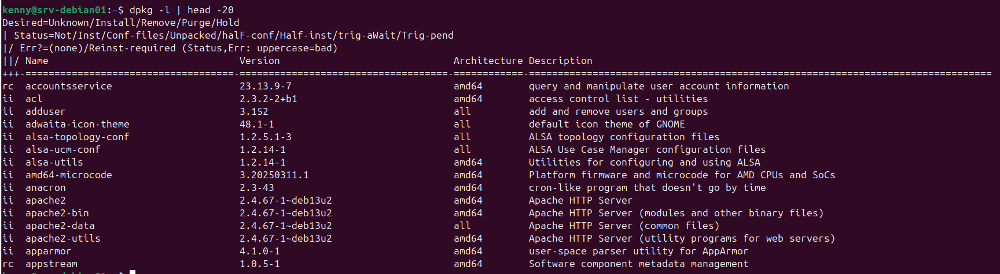
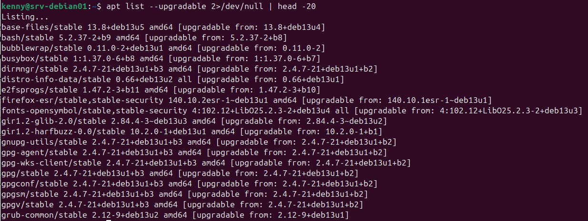
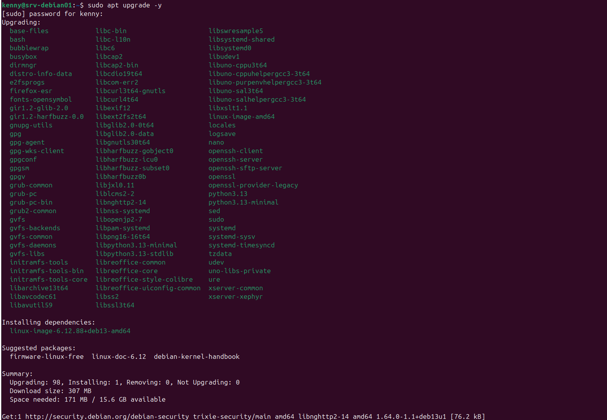
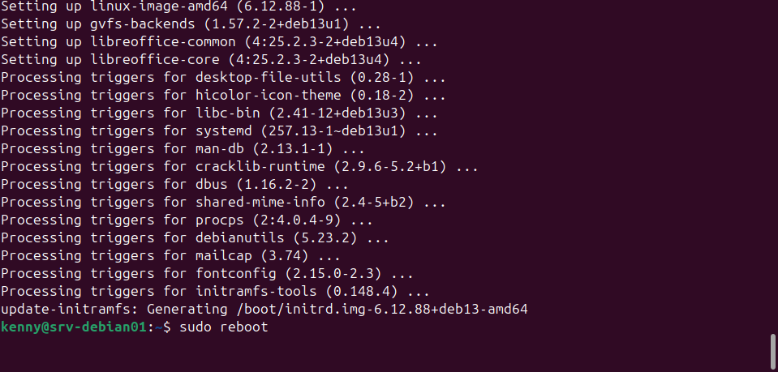
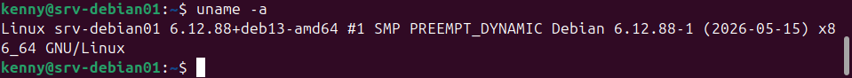

# Gestion des paquets — apt et dpkg

## Contexte
Installation et gestion des paquets sur srv-debian01 dans le cadre
de la mise en place de l'intranet de la Société DeltaWay.

## Différence entre apt et dpkg

| Outil | Rôle | Usage typique |
|-------|------|---------------|
| dpkg | Outil bas niveau — installe les .deb localement | `dpkg -l`, `dpkg -i fichier.deb` |
| apt | Outil haut niveau — télécharge et gère les dépendances | `apt install`, `apt update` |

apt utilise dpkg en coulisses — tout ce qu'apt installe
apparaît dans `dpkg -l`.

## Commandes essentielles

### Mettre à jour la liste des paquets
```bash
sudo apt update
```
À faire avant toute installation — met à jour le catalogue
des paquets disponibles depuis les dépôts.

### Installer un paquet
```bash
sudo apt install nom-du-paquet -y
```
`-y` répond automatiquement oui à la confirmation.
apt gère automatiquement toutes les dépendances.

### Voir les infos d'un paquet
```bash
apt show nom-du-paquet
```
Affiche version, taille, dépendances, description et source.

### Lister les paquets installés
```bash
dpkg -l
dpkg -l | grep nom-du-paquet
```

Statuts importants :
- `ii` → installé et fonctionnel ✅
- `rc` → supprimé mais fichiers de config encore présents

### Voir les mises à jour disponibles
```bash
apt list --upgradable 2>/dev/null
```
`2>/dev/null` supprime l'avertissement de stabilité d'apt.

### Mettre à jour tous les paquets
```bash
sudo apt upgrade -y
```

### Supprimer un paquet
```bash
sudo apt remove nom-du-paquet          # supprime le paquet
sudo apt remove --purge nom-du-paquet  # supprime + fichiers de config
sudo apt autoremove                    # supprime les dépendances inutiles
```

## Installation d'Apache2 — Intranet DeltaWay

### Contexte
Le directeur de DeltaWay demande la mise en place d'un intranet.
Installation d'Apache2 comme serveur web sur srv-debian01.

### Installation
```bash
sudo apt update
sudo apt install apache2 -y
```

apt installe automatiquement toutes les dépendances nécessaires :
`apache2-bin`, `apache2-data`, `apache2-utils` etc.

### Vérification du service
```bash
sudo systemctl status apache2
```

Résultat obtenu :
- `active (running)` ✅
- `enabled` — démarre automatiquement au boot ✅
- `Memory: 5.3M` — très faible consommation RAM ✅

### Test depuis l'hôte Ubuntu
Ouvrir un navigateur et accéder à :

http://192.168.33.128

Page par défaut Apache visible — intranet DeltaWay opérationnel ✅

## Mise à jour du système

```bash
sudo apt upgrade -y
sudo reboot
```

Résultats obtenus :
- 98 paquets mis à jour
- Nouveau noyau installé : `linux-image-6.12.88+deb13-amd64`
- Vérification après reboot :

```bash
uname -a
# Linux srv-debian01 6.12.88+deb13-amd64 ✅
```

Note : le message `Broken pipe` lors du reboot depuis SSH
est normal — la connexion SSH est coupée quand le serveur
redémarre. Se reconnecter après 30 secondes.

## Réflexions et apprentissages

- Je me suis demandé la différence entre apt et dpkg et j'ai trouvé une analogie par
  rapport à mon ancien métier de chauffeur livreur - apt est le transporteur qui va
  chercher les colis (paquets) chez un fournisseur et gère la logistique tandis que 
  dpkg est le gestionnaire d'entrepôt qui receptionne et enregistre tout. Tout ce 
  qu'apt amène se retrouve enregistré dans dpkg -l. En ce qui concerne l'installation, 
  apt peut tout faire tout seul alors que dpkg peut installer seulement si les paquets
  sont déjà présents dans l'entrepôt en ".deb".

- Il est important de faire apt update avant un apt install car sinon on installe 
  depuis un catalogue potentiellement obsolète et on rate des mises à jour de 
  sécurité.

## Screenshots













