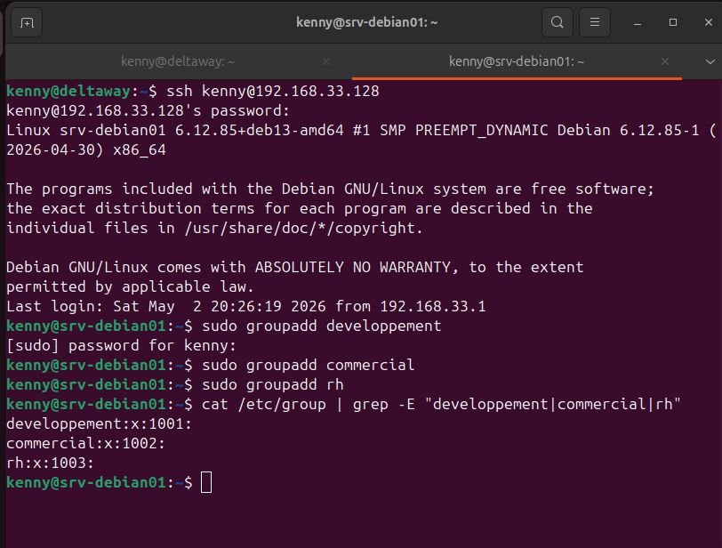
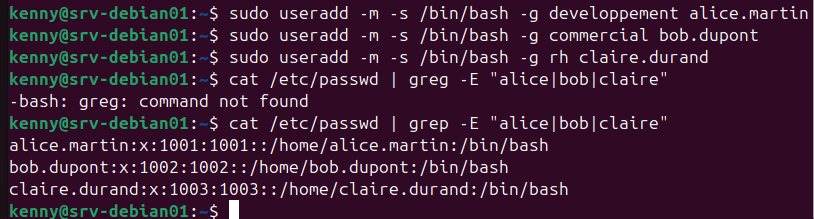
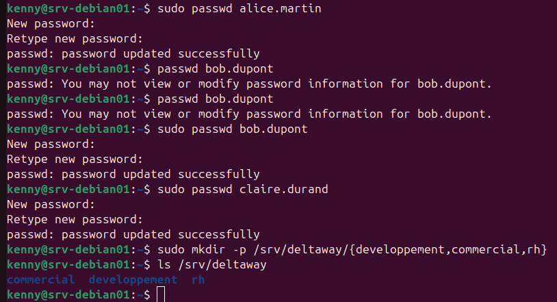
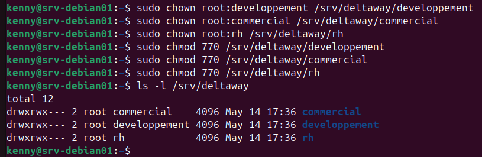
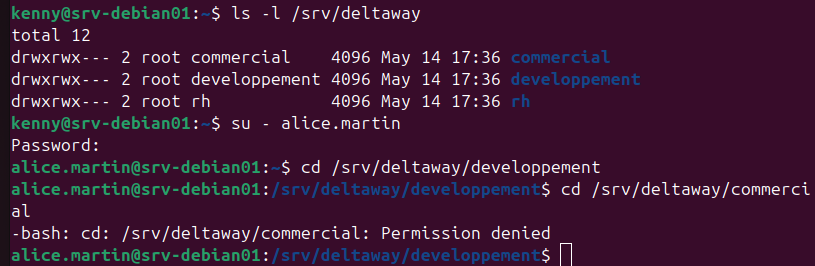

# Gestion des utilisateurs et des groupes — Société DeltaWay

## Contexte
Arrivée de trois nouveaux employés chez DeltaWay. 
En tant qu'administrateur systèmes je dois créer leurs comptes, 
leurs groupes et configurer les droits d'accès aux dossiers partagés.

## Employés concernés

| Utilisateur | Département |
|-------------|-------------|
| alice.martin | Développement |
| bob.dupont | Commercial |
| claire.durand | RH |

## 1. Création des groupes

```bash
sudo groupadd developpement
sudo groupadd commercial
sudo groupadd rh
```

Vérification :
```bash
cat /etc/group | grep -E "developpement|commercial|rh"
```

Les groupes permettent de gérer les droits par département 
plutôt qu'utilisateur par utilisateur — indispensable en entreprise.

## 2. Création des utilisateurs

```bash
sudo useradd -m -s /bin/bash -g developpement alice.martin
sudo useradd -m -s /bin/bash -g commercial bob.dupont
sudo useradd -m -s /bin/bash -g rh claire.durand
```

Options utilisées :
- `-m` : crée le dossier home (/home/utilisateur)
- `-s /bin/bash` : définit bash comme shell par défaut
- `-g` : assigne le groupe principal

Vérification :
```bash
cat /etc/passwd | grep -E "alice|bob|claire"
```

## 3. Définition des mots de passe

```bash
sudo passwd alice.martin
sudo passwd bob.dupont
sudo passwd claire.durand
```

## 4. Création des dossiers partagés

```bash
sudo mkdir -p /srv/deltaway/{developpement,commercial,rh}
```

Pourquoi /srv : le FHS (Filesystem Hierarchy Standard) 
définit /srv comme l'emplacement des données de services 
fournis par le serveur — c'est le choix le plus conforme 
aux standards Linux.

## 5. Attribution des groupes propriétaires

```bash
sudo chown root:developpement /srv/deltaway/developpement
sudo chown root:commercial /srv/deltaway/commercial
sudo chown root:rh /srv/deltaway/rh
```

## 6. Configuration des permissions

```bash
sudo chmod 770 /srv/deltaway/developpement
sudo chmod 770 /srv/deltaway/commercial
sudo chmod 770 /srv/deltaway/rh
```

Le chmod 770 signifie :
- 7 (propriétaire root) → rwx — tous les droits
- 7 (groupe département) → rwx — tous les droits
- 0 (autres) → aucun droit

Vérification :
```bash
ls -l /srv/deltaway/
```

Résultat attendu : drwxrwx--- pour chaque dossier ✅

## 7. Test de contrôle d'accès

Connexion en tant qu'alice.martin :
```bash
su - alice.martin
```

Test d'accès au dossier autorisé :
```bash
cd /srv/deltaway/developpement  # ✅ Accès autorisé
```

Test d'accès au dossier non autorisé :
```bash
cd /srv/deltaway/commercial  # ❌ Permission denied
```

Le contrôle d'accès fonctionne correctement — 
chaque employé accède uniquement aux dossiers de son département.

## Fichiers système importants

| Fichier | Rôle |
|---------|------|
| /etc/passwd | Liste des utilisateurs et leurs paramètres |
| /etc/group | Liste des groupes |
| /etc/shadow | Mots de passe chiffrés |

## Screenshots







## Réflexions et apprentissages

- Je me suis demandé pourquoi est ce qu'un dossier commun en entreprise doit être
  créer dans /srv et encore une fois c'est parce qu'il y a le FHS qui définit un rôle
  précis et normalisé à chaque dossier sur Linux. Un dossier commun en entreprise est 
  considéré comme service, c'est pourquoi on le retrouve dans le /srv.  

- L'utilisation du | grep est essentiel pour filtrer des longs résultats de commande.
  Avec l'option -E, la commande grep permet les expressions régulières étendues donc 
  plus besoin de d'échapper avec \.

- Bien utiliser pwd pour savoir où l'on se trouve avant de créer un dossier ou un
  fichier.


