# Installation Debian 13 — srv-debian01

## Contexte
Installation du premier serveur de l'infrastructure DeltaWay dans le cadre 
de ma formation TSSR. Ce serveur constitue la base du home lab.

## Caractéristiques de la VM

| Paramètre | Valeur |
|-----------|--------|
| Nom | srv-debian01 |
| OS | Debian 13 (Trixie) |
| RAM | 2 GB |
| Disque | 20 GB |
| Réseau | NAT |
| Hostname | srv-debian01 |
| Domaine | deltaway.local |

## Partitionnement

| Partition | Taille | Type | Point de montage |
|-----------|--------|------|-----------------|
| /dev/sda1 | 20.3 GB | ext4 | / |
| /dev/sda5 | 1.2 GB | swap | swap |

Choix retenu : partition unique — adapté pour un serveur de lab. 
En production on séparerait /var et /tmp sur des partitions dédiées 
pour éviter qu'un remplissage de logs n'impacte le système entier.

## Choix d'installation

- **Langue système** : English — les messages d'erreur en anglais 
sont plus faciles à rechercher en cas de problème
- **Clavier** : French — correspond au clavier physique AZERTY
- **Miroir** : ftp.fr.debian.org — miroir officiel français, 
proximité géographique optimale depuis Rennes
- **Mot de passe root** : désactivé — administration via sudo 
uniquement, meilleure pratique sécurité
- **Interface graphique** : non installée — serveur administré 
uniquement en CLI

## Erreurs rencontrées et corrections

Lors de la sélection des paquets (tasksel), GNOME a été installé 
par inadvertance. Correction effectuée après installation :

```bash
# Suppression de GNOME et xorg
sudo apt remove --purge gnome* task-gnome-desktop task-desktop xorg* -y
sudo apt autoremove -y

# Protection du paquet sudo contre la suppression automatique
sudo apt-mark manual sudo
```

## Services installés

### SSH Server
Installation après coup car non sélectionné pendant le tasksel :

```bash
sudo apt install openssh-server -y
```

Vérification du statut :
```bash
sudo systemctl status ssh
# active (running) ✅
sudo systemctl is-enabled ssh  
# enabled ✅
```

## Configuration du mode de démarrage

Passage en mode CLI pur (multi-user.target) :
```bash
sudo systemctl set-default multi-user.target
sudo reboot
```

Le serveur démarre désormais directement en ligne de commande, 
sans interface graphique — configuration standard d'un serveur en entreprise.

## Accès SSH depuis l'hôte

Connexion réussie depuis l'hôte Ubuntu :
```bash
ssh kenny@192.168.33.128
```

## Screenshots

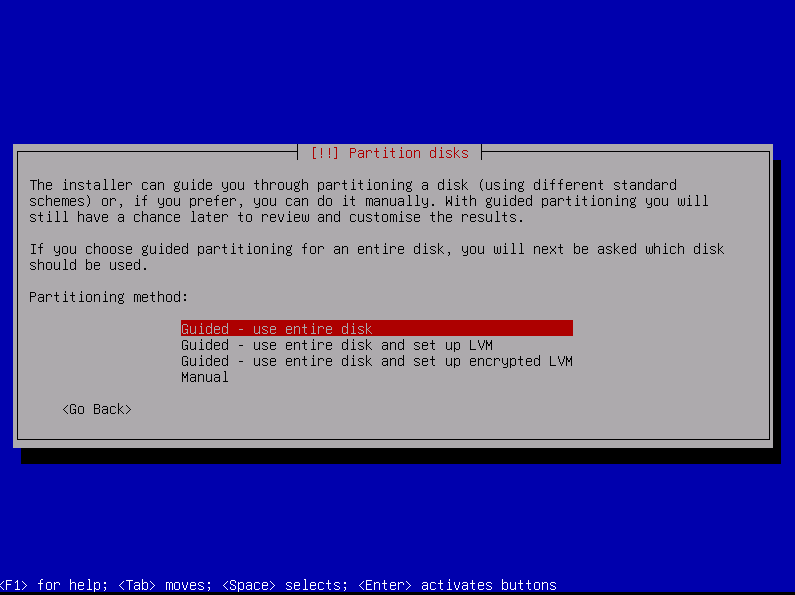
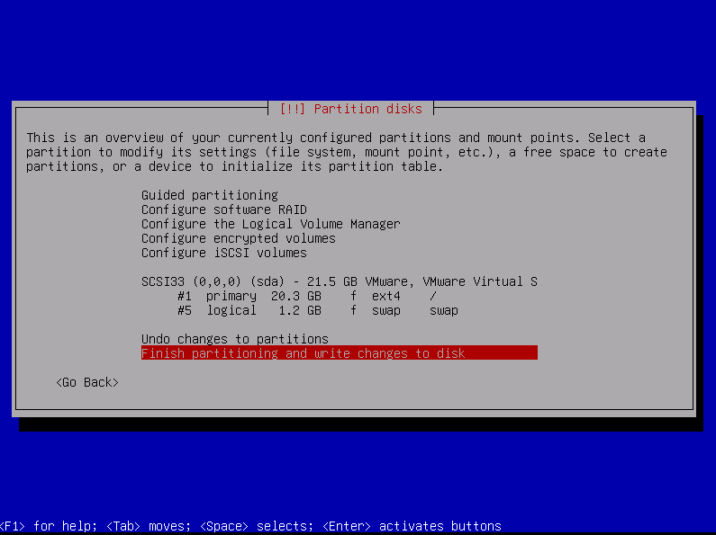
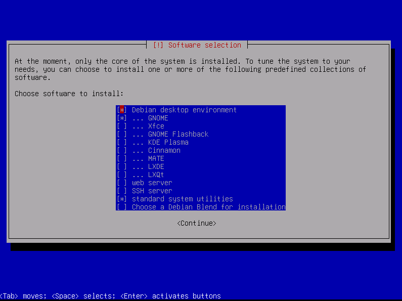
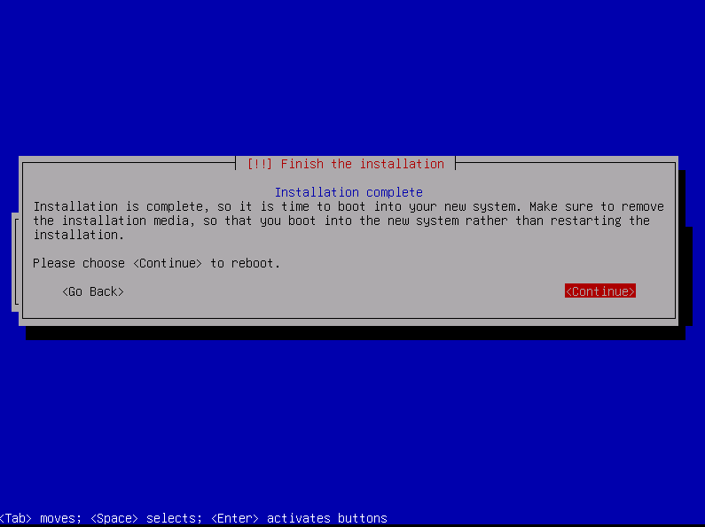
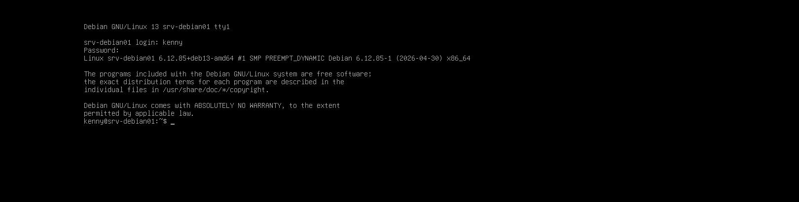
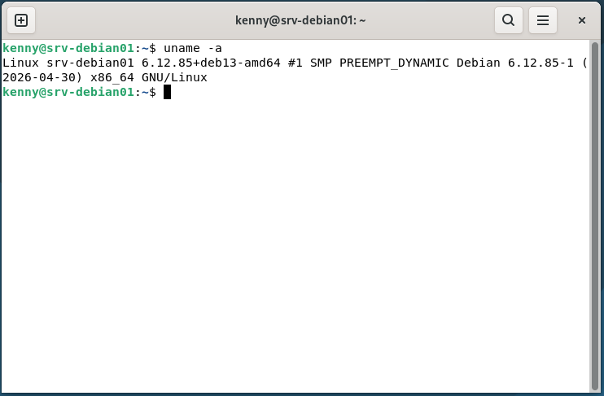
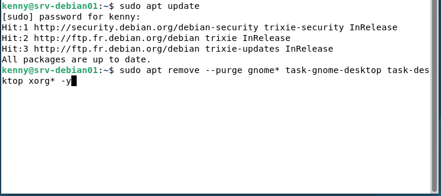
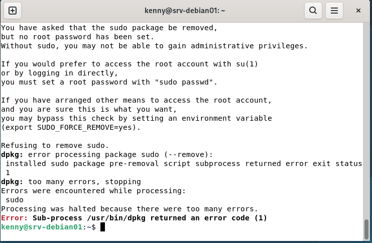
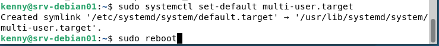
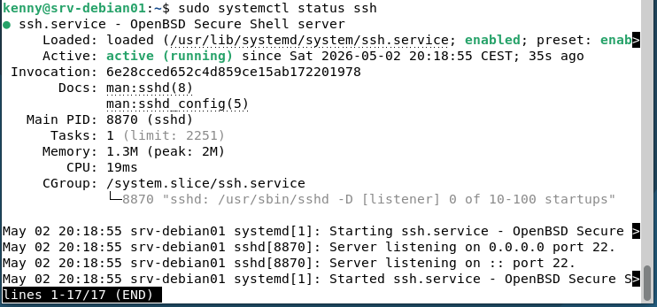
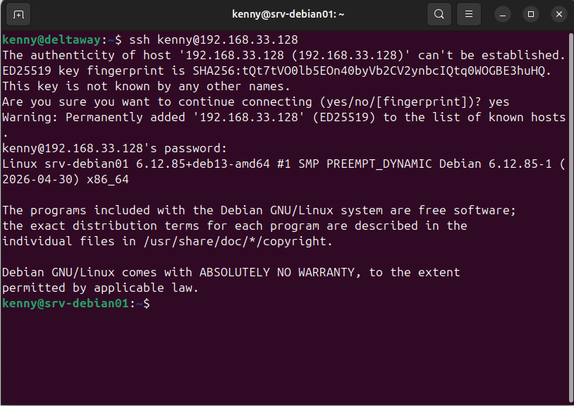
